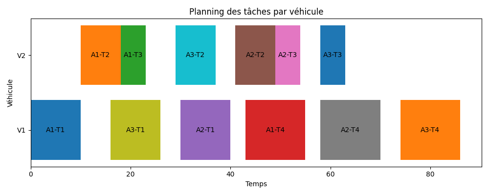
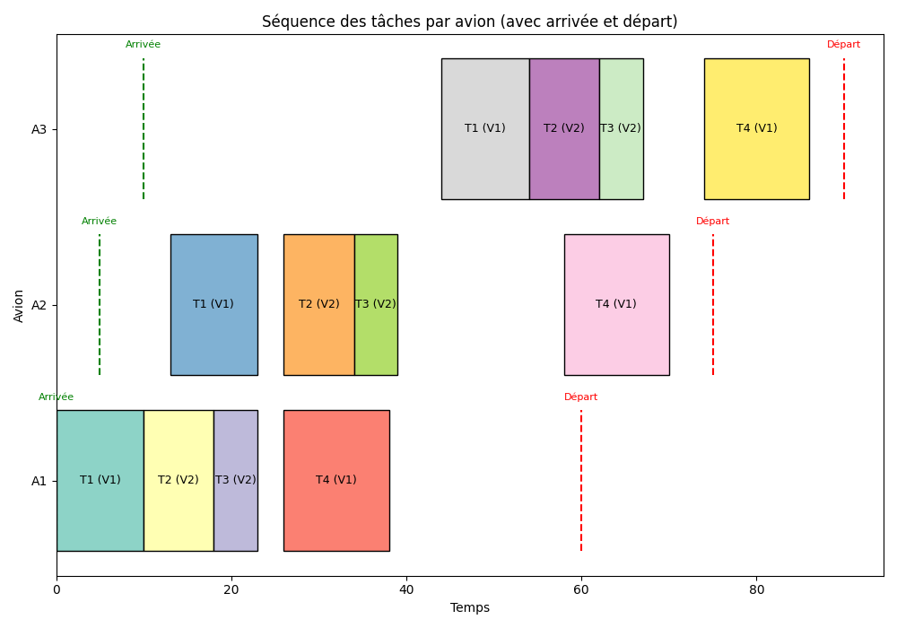

# Optimisation des opérations au sol aéroportuaires

## Présentation générale

Ce projet propose une **modélisation et une résolution complètes d’un problème d’optimisation des opérations au sol dans un aéroport** (ground handling).

Lorsqu’un avion arrive, une séquence de tâches doit être réalisée (par exemple : débarquement, nettoyage, embarquement), sous contraintes de temps et de ressources.  
Ces tâches doivent être assignées à une flotte limitée de véhicules spécialisés, capables de se déplacer entre différents parkings de l’aéroport.

L’objectif est de **calculer un planning réalisable et optimal**, en tenant compte de contraintes opérationnelles réalistes, et en minimisant la durée totale des opérations au sol (*makespan*).

---

## Contexte du problème

Le problème modélisé correspond à une situation opérationnelle réelle :

- Plusieurs avions sont présents simultanément sur le tarmac
- Chaque avion possède :
  - une heure d’arrivée
  - une heure de départ
  - un parking attitré
- Chaque avion nécessite l’exécution d’une suite de tâches ordonnées
- Les tâches :
  - ont des durées fixes
  - peuvent nécessiter des types de véhicules spécifiques
  - doivent respecter des contraintes de précédence
- Les véhicules :
  - sont disponibles en nombre limité
  - ne peuvent effectuer qu’une seule tâche à la fois
  - doivent se déplacer physiquement entre parkings

Ce problème combine plusieurs dimensions classiques de la recherche opérationnelle :
- ordonnancement
- affectation de ressources
- contraintes de précédence
- temps de déplacement
- fenêtres temporelles

---

## Données d’entrée

Les données sont fournies sous forme de fichiers CSV dans le dossier `data/` :

- `example_aircraft.csv`  
  Avions, parkings, heures d’arrivée et de départ

- `example_tasks.csv`  
  Tâches à réaliser (durée, précédence, type de véhicule requis)

- `example_vehicles.csv`  
  Flotte de véhicules (type, position initiale)

- `parking_graph.csv`  
  Temps de déplacement entre parkings (graphe pondéré)

---

## Modélisation mathématique (vue d’ensemble)

La résolution repose sur un **modèle de programmation par contraintes** implémenté avec **OR-Tools (CP-SAT)**.

### Variables de décision

- start_t : heure de début de la tâche t  
- end_t : heure de fin de la tâche t  
- assign_{v,t} ∈ {0,1} : vaut 1 si le véhicule v réalise la tâche t  
- y_{v,i,j} ∈ {0,1} : indique l’ordre d’exécution entre deux tâches i et j sur un même véhicule  

---

### Contraintes principales

#### Affectation

Chaque tâche est réalisée par **exactement un véhicule compatible**.

#### Non-chevauchement

Un véhicule ne peut exécuter **qu’une seule tâche à la fois**.

#### Fenêtres avion

Les tâches d’un avion doivent respecter :

    arrival ≤ start_t
    end_t ≤ departure

#### Précédence

Certaines tâches doivent être exécutées dans un ordre imposé :

    start_t ≥ end_prédécesseur

#### Temps de déplacement

Lorsqu’un véhicule passe d’une tâche située sur un parking à une autre :

    start_j ≥ end_i + travel_time(parking_i, parking_j)

Les temps de trajet sont extraits du graphe de parkings.

#### Position initiale des véhicules

Avant sa première tâche, un véhicule doit se déplacer depuis sa position initiale vers le parking de l’avion concerné.  
Le temps de trajet initial est pris en compte dans les contraintes de planification.

---

## Objectif d’optimisation

L’objectif est de **minimiser le makespan**, c’est-à-dire l’instant de fin de la dernière tâche :

    min max(end_t)

Cela permet de réduire le temps total d’occupation des ressources et d’optimiser les opérations au sol.

---

## Résultats et visualisations

Les résultats sont analysés à l’aide de diagrammes de Gantt générés dans le notebook de démonstration et situés dans `results/plots/`

### Planning par véhicule

Cette visualisation permet d’observer :
- l’utilisation de chaque véhicule
- les temps morts
- les temps de déplacement implicites entre tâches

---

### Planning par avion

Cette vue met en évidence :
- la séquence complète des tâches pour chaque avion
- le respect des heures d’arrivée et de départ
- le temps total passé au sol

---

## Structure du projet

- `data/`  
  Contient les données d’entrée au format CSV :
  - `example_aircraft.csv` : avions (parking, arrivée, départ)
  - `example_tasks.csv` : tâches (durée, précédence, type requis)
  - `example_vehicles.csv` : véhicules (type, position initiale)
  - `parking_graph.csv` : graphe des temps de déplacement entre parkings

- `docs/`
  Contient la modélisation mathématique complète au format PDF
  
  

- `src/optimization/ground_ops_model.py`  
  Implémentation du modèle OR-Tools (CP-SAT) :
  - chargement des données (`from_csv_folder`)
  - construction du modèle (`build_model`)
  - résolution (`solve`)
  - extraction de solution (`extract_solution`)

- `results/`
  - `results/solutions/` : solution exportée (CSV)
  - `results/plots/` : figures finales (Gantt avion / véhicule)

- `demo.ipynb`  
  Notebook de démonstration :
  - exécution end-to-end (data → solve → export → plots)
  - analyse de la solution et visualisations

- `README.md`  
  Description du problème, des données, du modèle et des résultats.

---

## Démonstration

Le notebook `demo.ipynb` permet de :

- charger les données
- construire le modèle d’optimisation
- résoudre le problème
- analyser la solution
- générer les visualisations

Il constitue le point d’entrée principal pour comprendre et tester le projet.

---

## Documentation théorique complète

**❗Important ❗**

La **formulation mathématique complète du problème**, ainsi que la **solution entièrement rédigée et détaillée**  (variables, contraintes, justification des choix de modélisation, schémas explicatifs) sont disponibles dans l’archive fournie avec ce projet.

Ce document complète le code et permet d’approfondir la compréhension théorique du modèle.

---

## Technologies utilisées

- Python
- OR-Tools (CP-SAT)
- Pandas
- Matplotlib
- Jupyter Notebook

---

## Remarques finales

Ce projet illustre une approche complète et rigoureuse de résolution d’un problème d’optimisation opérationnelle, de la modélisation mathématique à l’implémentation et à l’analyse des résultats.
